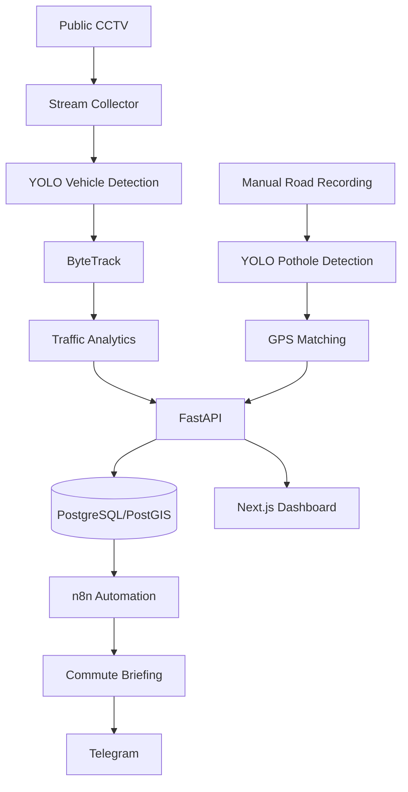

# Codex Prompt — Smart Road Monitoring & Commuter Assistant

You are a senior full-stack engineer specializing in Computer Vision, FastAPI, PostgreSQL/PostGIS, Next.js, real-time video processing, and n8n automation.

Build this project end-to-end. Do not only explain or produce pseudocode. Create the actual files, source code, database migrations, configuration, Docker setup, tests, documentation, and runnable application.

## PROJECT NAME

Smart Road Monitoring & Commuter Assistant

## CONTEXT

This is a capstone project for monitoring traffic conditions in Palembang, Indonesia.

The system has two different data sources:

1. Public CCTV streams in Palembang
   - Used ONLY for real-time vehicle detection, vehicle tracking, traffic volume, and traffic congestion analysis.
   - Do NOT use CCTV for pothole detection.

2. Manual road recording using smartphone/camera
   - Used for pothole detection.
   - Potholes will later be associated with GPS/location data from the manual recording.

The final system must combine traffic monitoring, pothole information, user commute routes, and n8n automation.

## IMPORTANT SAFETY / ACCESS RULE

For CCTV integration:

- Only use CCTV streams or endpoints that are publicly accessible and permitted for public viewing.
- Do not bypass authentication.
- Do not circumvent access controls.
- Do not exploit private/internal APIs.
- Do not attempt credential discovery.
- Do not scrape protected data.
- If a public stream endpoint cannot legally/reliably be discovered, implement an adapter interface and use a local demo video/mock stream.
- Document clearly how a legitimate public CCTV URL can later be added through configuration.

Do not hardcode an invented Palembang CCTV API endpoint.

---

## MAIN OBJECTIVE

Build an application with this flow:

```text
Palembang CCTV
    |
    v
Video Stream Collector
    |
    v
YOLO vehicle detection
    |
    v
ByteTrack vehicle tracking
    |
    v
Traffic analytics
    |
    v
FastAPI
    |
    +-------- PostgreSQL/PostGIS
    |
    +-------- Next.js Dashboard
    |
    +-------- n8n
                  |
                  v
             AI/Template
                  |
                  v
          Telegram notification
```

Separate module:

```text
Manual Road Video
    |
    v
YOLO Pothole Detection
    |
    v
GPS / Location Association
    |
    v
PostgreSQL/PostGIS
    |
    v
Dashboard + Route Warning
```

---

## TECH STACK

### Backend
- Python 3.12
- FastAPI
- SQLAlchemy
- Alembic
- Pydantic
- PostgreSQL
- PostGIS
- psycopg
- OpenCV
- FFmpeg
- Ultralytics YOLO
- ByteTrack

### Frontend
- Next.js latest stable
- TypeScript
- Tailwind CSS
- Leaflet
- OpenStreetMap
- Recharts

### Automation
- n8n

### Infrastructure
- Docker Compose
- `.env` configuration

### Testing
- pytest
- FastAPI TestClient
- frontend lint/typecheck

Do not add unnecessary technologies.

---

## REPOSITORY STRUCTURE

Create a clean monorepo approximately like:

```text
smart-road-monitoring/
|
|-- backend/
|   |-- app/
|   |   |-- api/
|   |   |-- core/
|   |   |-- db/
|   |   |-- models/
|   |   |-- schemas/
|   |   |-- services/
|   |   |-- traffic/
|   |   |-- pothole/
|   |   |-- routing/
|   |   |-- main.py
|   |
|   |-- alembic/
|   |-- tests/
|   |-- requirements.txt
|   |-- Dockerfile
|
|-- vision/
|   |-- traffic_worker/
|   |-- pothole_worker/
|   |-- shared/
|   |-- models/
|   |-- samples/
|
|-- frontend/
|
|-- n8n/
|   |-- workflows/
|
|-- scripts/
|
|-- docs/
|
|-- docker-compose.yml
|-- .env.example
|-- README.md
```

Keep modules separated and understandable.

---

## PHASE 1 — DATABASE DESIGN

Use PostgreSQL + PostGIS.

Create at least these tables.

### users
- id
- name
- email nullable
- timezone
- created_at

### cameras
- id
- name
- road_name
- latitude
- longitude
- stream_url nullable
- stream_type
- is_active
- created_at

### traffic_snapshots
- id
- camera_id
- timestamp
- motorcycle_count
- car_count
- bus_count
- truck_count
- total_count
- congestion_score
- traffic_status

`traffic_status` should support:
- LANCAR
- SEDANG
- PADAT
- MACET

### vehicle_events
- id
- camera_id
- tracker_id
- vehicle_type
- direction
- first_seen
- last_seen

### routes
- id
- user_id
- name
- route_type

`route_type` examples:
- commute_to_work
- commute_home
- custom

Also save:
- start_latitude
- start_longitude
- destination_latitude
- destination_longitude
- route geometry using PostGIS LineString
- notification_time
- is_active

### potholes
- id
- latitude
- longitude
- road_name nullable
- confidence
- severity
- image_path nullable
- detected_at
- status

Pothole status:
- active
- repaired
- unverified

Severity:
- low
- medium
- high

Create migrations using Alembic.

Seed demo cameras and demo data, but mark all demo CCTV entries clearly as DEMO.

Never pretend demo CCTV URLs are real public CCTV feeds.

---

## PHASE 2 — CCTV STREAM ABSTRACTION

Create a clean stream adapter architecture.

Example:

```text
BaseStreamSource
    open()
    read()
    close()
```

Implement:

- LocalVideoSource
- HLSStreamSource
- RTSPStreamSource

Configuration should allow:

```text
CAMERA_SOURCE=local
```

or:

```text
CAMERA_SOURCE=hls
```

or:

```text
CAMERA_SOURCE=rtsp
```

Do not bind computer vision directly to one CCTV website.

Create a camera configuration mechanism.

Example:

```text
cameras.yaml
```

or database-driven configuration.

For development, include a local sample-video mode.

If no sample video exists, document where the developer should place:

```text
vision/samples/traffic.mp4
```

The whole application must still boot even without a real CCTV feed.

---

## PHASE 3 — VEHICLE DETECTION

Implement YOLO vehicle detection.

Use a lightweight YOLO model suitable for near-real-time inference.

Detect only relevant road vehicles:

- motorcycle
- car
- bus
- truck

Ignore irrelevant COCO classes.

Provide configuration:

```text
YOLO_MODEL=
YOLO_CONFIDENCE=
YOLO_DEVICE=cpu/cuda
```

Do not require GPU.

CPU mode must work for development.

Each detection should produce:

```json
{
  "class": "car",
  "confidence": 0.92,
  "bounding_box": [100, 120, 300, 400]
}
```

---

## PHASE 4 — VEHICLE TRACKING

Integrate ByteTrack.

Every currently tracked vehicle should have an anonymous tracker ID such as:

```text
vehicle_42
```

Do NOT perform:

- face recognition
- driver recognition
- owner identification
- license plate identity tracking

Tracking is only for anonymous traffic analytics.

Avoid double counting vehicles across consecutive frames.

Implement optional line-crossing counting.

For every camera configure a virtual counting line.

Count a vehicle when its center point crosses the line.

Support direction:

```text
A_TO_B
B_TO_A
```

Store aggregated counts rather than storing every video frame.

---

## PHASE 5 — TRAFFIC ANALYTICS

Create traffic metrics based on rolling time windows.

At minimum calculate:

- vehicles per minute
- vehicle composition
- rolling 5-minute volume
- rolling 15-minute volume
- trend compared with previous interval
- traffic status

Do NOT blindly use one fixed universal threshold for every road.

Implement configurable thresholds per camera.

Provide reasonable demo defaults.

Example configurable structure:

```text
camera:
    low_threshold
    medium_threshold
    high_threshold
```

Traffic classification:

```text
LANCAR
SEDANG
PADAT
MACET
```

Expose both:

- congestion_score
- traffic_status

Also return trend:

```text
MENURUN
STABIL
MENINGKAT
```

---

## PHASE 6 — FASTAPI

Create REST API.

Required endpoints:

```text
GET /health

GET /api/cameras
GET /api/cameras/{id}
GET /api/cameras/{id}/traffic/current
GET /api/cameras/{id}/traffic/history
GET /api/traffic/current
GET /api/traffic/summary
```

User routes:

```text
POST /api/routes
GET /api/routes
GET /api/routes/{id}
PUT /api/routes/{id}
DELETE /api/routes/{id}
GET /api/routes/{id}/traffic
```

Potholes:

```text
POST /api/potholes
GET /api/potholes
GET /api/potholes/{id}
GET /api/routes/{id}/potholes
```

Commute briefing:

```text
GET /api/routes/{id}/briefing
```

Example response:

```json
{
  "route": "Rute Pulang",
  "traffic": [
    {
      "road": "Jl. Sudirman",
      "camera": "Simpang Example",
      "status": "MACET",
      "trend": "MENINGKAT"
    }
  ],
  "potholes": [],
  "overall_status": "PADAT",
  "generated_at": "..."
}
```

Do not let an LLM determine raw congestion values.

Congestion must come from deterministic analytics.

---

## PHASE 7 — ROUTE SYSTEM

Create a **Rute Saya** feature.

User should be able to define:

- Home
- Work

and create:

- Rute Berangkat
- Rute Pulang

For MVP, implement map-based route creation.

User can:

1. Select starting location on map.
2. Select destination.
3. Draw or edit route line manually.
4. Save it.

Store route geometry as PostGIS LineString.

Design routing code so an OSRM-compatible routing provider can later be added through an adapter, but do not make the MVP depend on an external paid API.

Create spatial queries to find:

- CCTV cameras near a user's route
- potholes near a user's route

Configurable distance examples:

```text
CAMERA_ROUTE_BUFFER_METERS=500
POTHOLE_ROUTE_BUFFER_METERS=100
```

Use PostGIS operations where appropriate.

---

## PHASE 8 — POTHOLE MODULE

Pothole detection does NOT use CCTV.

Input:

```text
manual road video
```

Implement a separate pothole worker.

Prepare YOLO custom-model inference architecture.

Allow configuration:

```text
POTHOLE_MODEL_PATH=...
```

If a trained pothole model is unavailable, create a clean placeholder/demo mode.

Do not pretend an untrained COCO model can properly detect potholes.

Implement:

```bash
python pothole_worker.py \
  --video road.mp4 \
  --gps road.gpx
```

Design GPS synchronization using timestamps.

If GPX timestamps are available:

```text
video timestamp
    |
    v
nearest/interpolated GPS timestamp
    |
    v
latitude / longitude
```

Save detected potholes.

Implement duplicate suppression.

For example:
if a pothole is detected multiple times within a configurable geographic radius, treat it as one pothole.

Config:

```text
POTHOLE_DUPLICATE_RADIUS_METERS=10
```

Save:

- latitude
- longitude
- confidence
- image evidence
- timestamp

Do not invent severity using bounding-box size alone unless clearly marked as heuristic.

For MVP, severity can be:

- manually assigned
- or heuristic with explicit documentation

---

## PHASE 9 — FRONTEND DASHBOARD

Create modern responsive dashboard.

Pages:

```text
/dashboard
/cctv
/cctv/[id]
/map
/routes
/routes/[id]
/potholes
/settings
```

Dashboard cards:

- CCTV Online
- Vehicles Last 5 Minutes
- Congested Roads
- Detected Potholes

Traffic panel:

- current traffic level
- vehicles/minute
- car
- motorcycle
- bus
- truck
- trend

Charts:

- Traffic Volume Over Time
- Vehicle Type Distribution

Map:

OpenStreetMap + Leaflet

Show:

- camera marker
- pothole marker
- saved commute route

Marker types should be distinguishable.

Clicking a CCTV marker opens:

- camera name
- road
- current traffic condition
- latest update

Clicking a pothole marker opens:

- confidence
- severity
- detected date
- image if available

---

## PHASE 10 — LIVE CAMERA UI

For development, provide either:

- MJPEG endpoint
- processed WebSocket frame metadata
- or another simple maintainable local solution

Display bounding boxes during demo.

Show:

```text
CAR #12
MOTORCYCLE #18
```

Do not make the database store every video frame.

Use live processing.

---

## PHASE 11 — COMMUTE BRIEFING

Implement deterministic route briefing data.

Input:

```text
route ID
```

System checks:

- CCTV cameras near route
- traffic condition
- traffic trend
- potholes near route

Generate structured briefing JSON.

Example:

```json
{
  "route_name": "Rute Pulang",
  "overall_status": "PADAT",
  "issues": [
    {
      "type": "traffic",
      "road": "Jl. Sudirman",
      "status": "MACET",
      "trend": "MENINGKAT"
    },
    {
      "type": "pothole",
      "road": "Jl. Example",
      "severity": "medium"
    }
  ]
}
```

Create a separate formatter that turns it into Indonesian text:

```text
Jl. Sudirman lagi macet nih dan volume kendaraan sedang meningkat.
```

Do not require a paid AI API for MVP.

Provide two modes:

```text
BRIEFING_MODE=template
BRIEFING_MODE=llm
```

Template mode must always work.

LLM integration should use a clean provider interface and remain optional.

---

## PHASE 12 — N8N AUTOMATION

Include an importable n8n workflow JSON.

Workflow:

```text
Schedule Trigger
    |
    v
Get user active commute routes
    |
    v
Check current time / route type
    |
    v
HTTP Request FastAPI
    |
    v
/api/routes/{id}/briefing
    |
    v
Message formatter
    |
    v
Telegram
```

Support:

Morning:

```text
commute_to_work
```

Afternoon/evening:

```text
commute_home
```

Environment/config examples:

```text
MORNING_NOTIFY_TIME=06:45
EVENING_NOTIFY_TIME=16:45
```

Timezone:

```text
Asia/Jakarta
```

Telegram configuration:

```text
TELEGRAM_BOT_TOKEN
TELEGRAM_CHAT_ID
```

Do not hardcode secrets.

Create `.env.example`.

Example notification:

```text
🚦 Info perjalanan pulang

Jl. Sudirman lagi padat nih.
Volume kendaraan dalam beberapa menit terakhir meningkat.

Ada 1 titik jalan berlubang yang terdata di rute kamu.

Hati-hati di jalan.
```

If route is clear:

```text
✅ Rute pulang kamu saat ini relatif lancar.

Traffic conditions may change while travelling.
```

---

## PHASE 13 — CCTV PUBLIC STREAM DISCOVERY TOOLING

Do NOT assume a CCTV API exists.

Create documentation:

```text
docs/cctv-integration.md
```

Explain how an authorized developer can inspect a public CCTV website using browser Developer Tools:

```text
Network
Fetch/XHR
Media
```

Possible formats:

```text
HLS .m3u8
RTSP
WebRTC
MJPEG
```

Create optional diagnostic script:

```text
scripts/check_stream.py
```

Usage:

```bash
python scripts/check_stream.py "<public-stream-url>"
```

It should report whether FFmpeg/OpenCV can read the stream.

Never include bypass logic.

Never scrape credentials or private endpoints.

---

## PHASE 14 — DEMO MODE

This capstone must be demonstrable without depending on government CCTV availability.

Create:

```text
DEMO_MODE=true
```

When enabled:

- use local traffic video
- run YOLO
- run ByteTrack
- generate traffic data
- save data to database
- display result in dashboard
- n8n can consume the generated results

Also create seed potholes around demo coordinates.

Clearly label demo values.

---

## PHASE 15 — DOCKER

Create `docker-compose.yml` for:

- PostgreSQL + PostGIS
- backend
- frontend
- n8n

Computer vision worker can initially run outside Docker if GPU/device access makes Docker unnecessarily complicated.

Document both approaches.

Ports should be configurable.

Suggested:

```text
Frontend: 3000
FastAPI: 8000
PostgreSQL: 5432
n8n: 5678
```

---

## PHASE 16 — DEVELOPER EXPERIENCE

Create:

- Makefile
- or scripts for setup/dev/test/lint/migrate/seed

Example:

```bash
make dev
make test
make migrate
make seed
```

Create useful logging.

Log format examples:

```text
[CAMERA] started camera=demo-01
[YOLO] inference fps=...
[TRACKER] active_tracks=...
[TRAFFIC] status=PADAT
[DATABASE] snapshot_saved
[N8N] briefing_requested
```

Handle camera disconnect gracefully.

Use reconnect with exponential backoff.

One broken CCTV stream must not crash the entire system.

---

## PHASE 17 — TESTING

Add tests for:

- traffic classification
- rolling traffic calculation
- route creation
- camera-route matching
- pothole-route matching
- duplicate pothole detection
- API health endpoint
- traffic API
- briefing endpoint

Tests must not require real CCTV.

---

## PHASE 18 — README

README must explain:

1. Project purpose
2. Architecture
3. Technologies
4. Local requirements
5. Environment setup
6. PostgreSQL/PostGIS
7. Backend setup
8. Frontend setup
9. YOLO setup
10. Local video demo
11. n8n setup
12. Telegram setup
13. Pothole worker
14. How to add a legitimate CCTV stream
15. Testing
16. Troubleshooting

Include architecture diagram using Mermaid.

---

## CAPSTONE ARCHITECTURE

Use approximately:



---

## IMPORTANT ENGINEERING RULES

1. Do not put all logic into one Python file.
2. Use separation of concerns.
3. Use type hints.
4. Use async FastAPI endpoints where appropriate.
5. Keep environment variables outside code.
6. Never commit credentials.
7. Never invent CCTV API URLs.
8. Never fake model accuracy.
9. Never claim demo data is real Palembang traffic.
10. Never use an LLM to determine congestion from raw video.
11. Computer vision produces quantitative data.
12. Analytics determines congestion.
13. AI/template layer only converts structured information into natural language.
14. Pothole detection and CCTV traffic monitoring must remain separate modules.
15. Prioritize a working MVP over unnecessary complexity.

---

## IMPLEMENTATION ORDER

Execute in this order:

1. Inspect current repository.
2. Create architecture and folders.
3. Create docker-compose PostgreSQL/PostGIS.
4. Implement database models and Alembic.
5. Implement FastAPI.
6. Add demo data.
7. Implement traffic analytics.
8. Implement local-video YOLO detection.
9. Add ByteTrack.
10. Connect vision output to API/database.
11. Build Next.js dashboard.
12. Build Leaflet map.
13. Build user route feature.
14. Implement spatial queries.
15. Scaffold pothole worker.
16. Implement commute briefing.
17. Create n8n workflow.
18. Add tests.
19. Run tests.
20. Fix errors.
21. Run lint/typecheck.
22. Fix errors.
23. Create full README.
24. Provide final startup commands.

Do not stop after scaffolding.

Actually run commands and fix errors where possible.

If a dependency version causes incompatibility, resolve it rather than leaving the repository broken.

---

## MVP SUCCESS CRITERIA

The project is considered complete when I can:

1. Run PostgreSQL/PostGIS.
2. Start FastAPI.
3. Start Next.js.
4. Open dashboard.
5. Add/view CCTV locations.
6. Run a local traffic video.
7. See YOLO vehicle detection.
8. See anonymous ByteTrack IDs.
9. Store aggregated traffic data.
10. See traffic charts.
11. See camera markers on map.
12. Create "Rute Berangkat".
13. Create "Rute Pulang".
14. See cameras close to the selected route.
15. Add/display pothole coordinates.
16. See potholes near the selected route.
17. Call:

```text
GET /api/routes/{id}/briefing
```

18. Receive Indonesian commute information.
19. Import the provided n8n workflow.
20. Send the commute notification through Telegram.
21. Run tests successfully.

---

## FIRST EXECUTION

Start now.

First inspect the environment and repository.

Then create:

```text
docs/IMPLEMENTATION_PLAN.md
```

After that immediately begin implementation.

Do not ask me generic questions about architecture or technology choices unless an absolutely required credential, stream URL, or external account is missing.

When an external dependency is missing, continue developing everything that does not depend on it.

For CCTV, start with LOCAL VIDEO DEMO MODE.

For Telegram, prepare configuration and n8n workflow even if the token is not available yet.

For the pothole model, create the full inference pipeline and demo/mock adapter if a trained model is not yet supplied.

At the end report:

- what was implemented
- directory structure
- services and ports
- migrations created
- tests executed
- commands that passed
- commands that failed
- remaining external configuration
- exact commands I must run to start the project

Begin implementation now.

---

## CONTINUATION PROMPT

If Codex stops after creating only the project structure, send this:

```text
Continue implementing the project. Do not summarize yet.
Follow IMPLEMENTATION_PLAN.md and continue from the first unfinished task.
Run the application and tests yourself, inspect errors, fix them, and continue until the MVP success criteria are satisfied.
Do not replace unfinished implementation with TODO comments unless an external credential, CCTV URL, or trained model is genuinely required.
```
