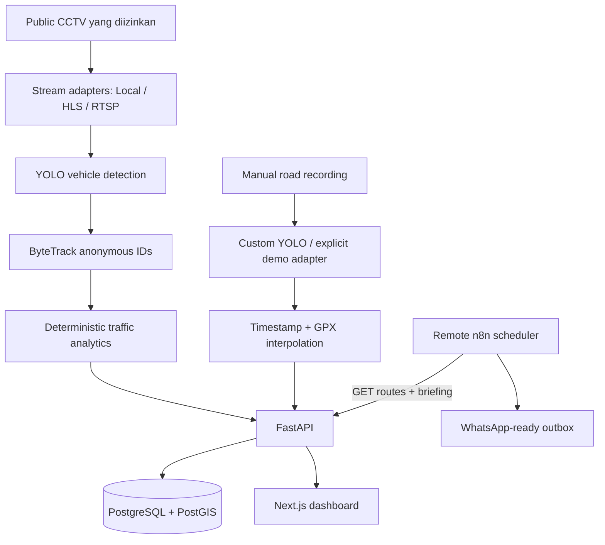

# Smart Road Monitoring & Commuter Assistant

MVP capstone untuk memantau arus kendaraan dan membantu perjalanan harian di Palembang. CCTV publik yang sah hanya dipakai untuk deteksi/tracking kendaraan anonim dan analytics lalu lintas. Deteksi jalan berlubang berasal dari rekaman manual + GPS dalam pipeline terpisah.

> Semua kamera dan angka seed diberi label **DEMO**. Repo ini tidak menyertakan, menebak, atau mengklaim endpoint CCTV pemerintah sebagai endpoint publik.

## Arsitektur



### Batas modul

- `vision/traffic_worker`: YOLO kendaraan, ByteTrack, line crossing, agregasi snapshot.
- `vision/pothole_worker`: model pothole kustom, GPX, bukti gambar, deduplikasi lokasi. Tidak membaca CCTV.
- `backend`: model data, query spasial, analytics, API, briefing template/optional formatter.
- `frontend`: dashboard, charts, peta, CCTV, route editor, potholes, settings.
- `n8n`: workflow instance remote: schedule → rute aktif → briefing API → WhatsApp-ready outbox.

## Teknologi

- Python 3.12, FastAPI, SQLAlchemy 2, Alembic, psycopg, PostgreSQL 16/PostGIS.
- OpenCV, Ultralytics YOLO, ByteTrack (integrasi resmi Ultralytics), FFmpeg/FFprobe.
- Next.js 16, React 19, TypeScript, Tailwind CSS 4, Leaflet/OpenStreetMap, Recharts, SWR.
- n8n remote; integrasi provider WhatsApp disiapkan sebagai langkah lanjutan.

## Struktur repo

```text
backend/                 FastAPI, models, migration, test
vision/                  traffic worker, pothole worker, sample config
frontend/                Next.js App Router dashboard
n8n/workflows/           workflow JSON siap impor
scripts/check_stream.py  diagnostik read-only stream
docs/                    panduan integrasi dan implementation plan
docker-compose.yml       PostGIS, API, dan web lokal
Makefile                 setup/dev/test/lint helpers
```

## Persyaratan lokal

- Docker Engine + Docker Compose v2 untuk database, API, dan frontend lokal.
- Python 3.12 dan Node.js 20.9+ untuk pengembangan native.
- FFmpeg/FFprobe untuk diagnostik video.
- CPU cukup untuk demo; CUDA opsional.

Mesin tanpa Docker tetap dapat menjalankan API memakai SQLite dan frontend secara lokal. Worker vision membutuhkan instalasi dependency tambahan yang cukup besar.

## Setup environment

```bash
cp .env.example .env
# Ubah POSTGRES_PASSWORD untuk deployment nyata.
```

`docker-compose.yml` membangun `DATABASE_URL` internal sendiri (`postgres:5432`). Nilai `.env.example` memakai `localhost:5432` agar perintah backend native dapat tersambung ke database Docker.

## Cara tercepat: Docker Compose

```bash
docker compose up --build
```

Service dan port default:

| Service | URL/port | Fungsi |
|---|---:|---|
| Frontend | http://localhost:3000 | Dashboard |
| FastAPI | http://localhost:8000 | REST, WebSocket, Swagger `/docs` |
| PostgreSQL/PostGIS | localhost:5432 | Data + spatial query |

n8n tidak dijalankan oleh Compose. Automation menggunakan instance remote dan workflow di repo tetap dapat diimpor ke sana.

Backend container menjalankan `alembic upgrade head`, seed demo idempotent, kemudian Uvicorn. Ubah port melalui `.env`.

## Setup backend native

Dengan PostGIS dari Docker:

```bash
python3 -m venv .venv
.venv/bin/pip install -r backend/requirements.txt
docker compose up -d postgres
cd backend
../.venv/bin/alembic upgrade head
../.venv/bin/python scripts_seed.py
../.venv/bin/uvicorn app.main:app --reload --port 8000
```

Tanpa PostgreSQL, jalankan demo SQLite:

```bash
cd backend
DATABASE_URL=sqlite:///./smartroad.db DEMO_MODE=true \
  ../.venv/bin/uvicorn app.main:app --reload --port 8000
```

Dokumentasi interaktif tersedia di `http://localhost:8000/docs`. Endpoint utama termasuk `/api/traffic/current`, CRUD `/api/routes`, spatial `/api/routes/{id}/traffic`, `/potholes`, dan `/briefing`.

## Setup frontend native

```bash
cd frontend
npm install
NEXT_PUBLIC_API_URL=http://localhost:8000 npm run dev
```

Halaman tersedia: `/dashboard`, `/cctv`, `/cctv/[id]`, `/map`, `/routes`, `/routes/[id]`, `/potholes`, dan `/settings`. Pada editor rute, klik titik awal, titik antara, lalu tujuan; gunakan tombol undo/clear sebelum menyimpan.

## PostgreSQL/PostGIS dan migration

Migration `backend/alembic/versions/0001_initial_schema.py` mengaktifkan PostGIS, membuat tujuh tabel domain, dan GiST index pada lokasi kamera, rute, serta pothole. Query produksi memakai `ST_DWithin` melalui geography cast agar buffer dalam meter. Test SQLite memakai kalkulasi segment-distance yang deterministik.

```bash
make migrate
make seed
```

## Traffic YOLO + ByteTrack

1. Instal dependency vision:

   ```bash
   make vision-install
   ```

2. Taruh video yang berhak digunakan di `vision/samples/traffic.mp4`.
3. Pastikan API database sudah dimigrasikan dan seed tersedia.
4. Jalankan:

   ```bash
   CAMERA_SOURCE=local CAMERA_STREAM_URL=vision/samples/traffic.mp4 \
   PYTHONPATH=backend:. .venv/bin/python -m vision.traffic_worker.worker \
     --camera-id 1 --show
   ```

Default `YOLO_MODEL=yolo11n.pt`, `YOLO_DEVICE=cpu`, dan confidence 0.35. Kelas yang diterima hanya motorcycle, car, bus, truck. `model.track(... tracker="bytetrack.yaml", persist=True)` menghasilkan ID anonim seperti `vehicle_42`. Kendaraan dihitung saat melintasi virtual line; database hanya menerima snapshot agregat dan event crossing, bukan frame.

Jika file/stream putus, worker melakukan reconnect dengan exponential backoff. API dan dashboard tetap boot walau video tidak ada. Untuk server/headless, hilangkan `--show`.

## Live camera metadata

Worker memproses frame secara langsung. Metadata ringan tersedia lewat:

```text
ws://localhost:8000/api/cameras/{id}/stream/metadata
```

Payload berisi status lalu lintas dan event tracker terkini; frame video tidak masuk database. Preview bounding box dashboard diberi label demo sampai worker/video aktual dijalankan.

## Pothole worker

Gunakan bobot YOLO yang memang dilatih untuk pothole—model COCO standar tidak diklaim mampu melakukan tugas ini:

```bash
export POTHOLE_MODEL_PATH=vision/models/pothole/best.pt
PYTHONPATH=backend:. .venv/bin/python pothole_worker.py \
  --video road.mp4 --gps road.gpx
```

Severity default adalah `unknown`; confidence model bukan ukuran keparahan fisik. Untuk demo pipeline eksplisit gunakan `--demo`; hasilnya sintetis dan dicatat demikian. Pipeline dataset, grouped split, training, evaluasi, dan export dijelaskan di [training README](training/README.md). Integrasi runtime ada di [panduan pothole](docs/pothole-worker.md).

## CCTV yang sah

Konfigurasi mendukung `local`, `hls`, dan `rtsp`. Tambahkan URL hanya jika dapat diakses secara publik dan pemrosesannya diizinkan. Uji:

```bash
.venv/bin/python scripts/check_stream.py "<authorized-url>"
```

Langkah Developer Tools, format stream, dan batas akses dijelaskan di [panduan integrasi CCTV](docs/cctv-integration.md).

## Commute briefing dan optional LLM

`GET /api/routes/{id}/briefing` selalu menghitung status dari snapshot + threshold kamera, lalu mencari kamera/pothole dekat route. `BRIEFING_MODE=template` tidak memerlukan layanan berbayar.

Mode `llm` hanya boleh memformat data yang sudah terstruktur:

```dotenv
BRIEFING_MODE=llm
LLM_API_URL=https://provider.example/v1/chat/completions
LLM_API_KEY=...
LLM_MODEL=...
```

Jika konfigurasi kosong atau request gagal, formatter kembali ke template. Model bahasa tidak bisa menentukan nilai congestion.

## Remote n8n + WhatsApp-ready outbox

1. Draft **Smart Road - Commute Briefing (WhatsApp Ready)** sudah dibuat di n8n remote. Jika perlu membuat salinan, impor `n8n/workflows/commute-briefing-whatsapp.json`.
2. Atur environment server sesuai `n8n/.env.remote.example`.
3. `BACKEND_API_URL` harus menunjuk ke FastAPI yang dapat diakses dari server n8n; `localhost:8000` pada server remote bukan backend laptop ini.
4. Sambungkan provider WhatsApp dan pemetaan nomor penerima nanti, uji dengan nomor sandbox, lalu publish workflow.

Workflow berjalan setiap menit, memilih rute aktif sesuai `notification_time` atau fallback 06:45/16:45, memanggil briefing FastAPI, lalu berhenti di payload outbox. `recipient_phone` masih kosong dan `ready_to_send=false`, sehingga belum ada pesan yang dikirim. Panduan lengkap: [n8n remote dan WhatsApp](docs/n8n-whatsapp.md).

## Testing dan quality checks

Test tidak membutuhkan CCTV, GPU, atau PostgreSQL:

```bash
make test
make lint
cd frontend && npm run build
```

Coverage fungsional mencakup traffic classification, rolling window, trend, route creation, camera/pothole proximity, duplicate pothole, health, traffic API, briefing, dan GPS interpolation.

## Troubleshooting

- **Dashboard connection error:** pastikan `curl http://localhost:8000/health` berhasil dan `NEXT_PUBLIC_API_URL` benar saat frontend dibangun.
- **PostGIS connection refused:** tunggu healthcheck `postgres`, cek port/password `.env`, lalu `docker compose logs postgres`.
- **Migration geometry error:** gunakan image `postgis/postgis`, bukan PostgreSQL polos.
- **Video tidak ditemukan:** tambahkan `vision/samples/traffic.mp4`; API sengaja tetap berjalan tanpanya.
- **YOLO lambat di CPU:** pakai model nano, turunkan resolusi video, atau atur device CUDA yang tersedia.
- **Tile peta kosong:** browser membutuhkan koneksi ke server tile OpenStreetMap; jangan membebani server tile dengan penggunaan produksi masif.
- **Remote n8n tidak menjangkau API:** deploy/tunnel FastAPI melalui HTTPS yang sah dan isi `BACKEND_API_URL`; jangan gunakan localhost.
- **WhatsApp belum terkirim:** ini memang kondisi draft; pilih provider, petakan nomor E.164, pasang credential pada n8n, lalu tambahkan node pengiriman setelah outbox.
- **Port sudah dipakai:** ubah `FRONTEND_PORT`, `BACKEND_PORT`, atau `POSTGRES_PORT` di `.env`.

## Perintah ringkas

```bash
make setup       # venv, dependency backend/frontend, salin .env
make dev         # stack Docker penuh
make backend     # API native
make frontend    # Next.js native
make test        # pytest
make lint        # Ruff + ESLint + TypeScript
```
